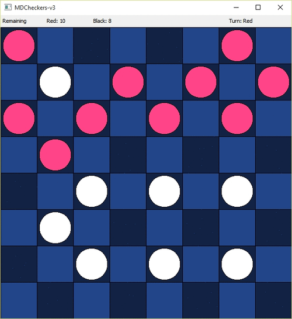

# **Super Maxio Checkers Game**
This game is designed for MLH Snakes and Hackers hackathon.
# Theme - board games

## Table Of Contents:

### 1.  [Overview](#overview)
### 2.  [Syntax](#syntax)

---

## Overview

Checkers game based on AI algorithm minimax, the algorithm analyses player's moves and king pieces transform into super mario.

Made with Pygame

[](https://www.python.org/)

[]
---


## Syntax

1. Start your favorite Command-Line program, in **administrator** or **sudo** mode as per your Operating System.

2. Change your current directory, to where the project is saved.

3. For Linux based systems,

```bash
python3 main.py 
```

   For Windows systems,

```shell
python main_windows.py 
```

5. Let it run !

---


